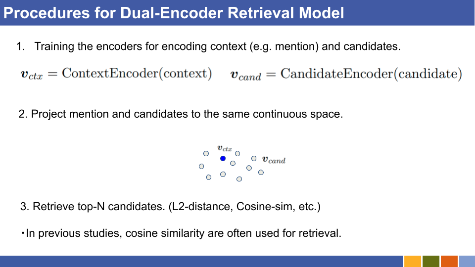

# Dual-Encoder-Based Zero-Shot Entity Linking
## Quick Starts in 3 minutes

```
git clone https://github.com/izuna385/Zero-Shot-Entity-Linking.git
cd Zero-Shot-Entity-Linking
sh preprocessing.sh  # ~3 min
python3 ./src/train.py -num_epochs 1
```
For further speednizing to check entire script, run the following command.

`python3 ./src/train.py -num_epochs 1 -debug True`

also, multi-gpu is supported.

`CUDA_VISIBLE_DEVICES=0,1 python3 ./src/train.py -num_epochs 1 -cuda_devices 0,1`

## Descriptions

* This experiments aim to confirm whether fine-tuning pretraind BERT (more specifically, encoders for mention and entity) is effective even to the unknown domains.

  * Following [[Logeswaran et al., '19]](https://github.com/lajanugen/zeshel), entities are not shared between train-dev and train-test.

  * If you are interested in what this repository does, see the original paper, or unofficial slides.

    * [Original paper](https://arxiv.org/abs/1911.03814)

    * [Unofficial slides](https://speakerdeck.com/izuna385/zero-shot-entity-linking-with-dense-entity-retrieval-unofficial-slides-and-entity-linking-future-directions)

# Requirements
* `torch`,`allennlp`,`transformers`, and `faiss` are required. See also `requirements.txt`.

* ~3 GB CPU and ~1.1GB GPU are necessary for running script.

# How to run experiments

## 1. Preprocessing

* Run `sh preprocessing.sh` at this directory.

  * The Datasets are derived from [[Logeswaran et al., '19]](https://github.com/lajanugen/zeshel).

## 2. Training and Evaluate Bi-Encoder Model

* `python3 ./src/train.py`

  * This script trains encoder for mention and entity.

  []()
  <div align="center"></div>

## 3. Logging Each Experiment

* See `./src/experiment_logdir/`.

  * Log directory is named after when the experiment starts.


## TODO

* Preprocess with more strict sentence boundary.

# LICENSE

* MIT
